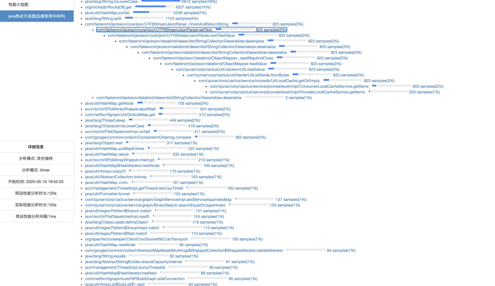

# 性能分析

## 前提
升级bistoury到最新版

## 保存时间
性能分析结果默认只保存三天

## bistoury中的性能分析

目前对java应用进行性能分析的方法主要有三种，插桩统计，同步抽样，异步抽样。
在这里面，插桩统计堆应用性能影响过大，基本无法接受；异步抽样无论从性能影响还是准确性上都比同步抽样要更好。
因此，bistoury选用了基于[async-profiler](https://github.com/jvm-profiling-tools/async-profiler)的异步抽样，并在操作、配置和结果处理上做了一系列优化，开发人员可以一键对应用进行cpu profiling。

## 如何开始
`主机信息`里面点击`性能分析`,

选择抽样持续时间，就可以对应用程序进行性能分析(建议在应用运行一段时间后再进行，防止结果被jit影响)

查看结果:

### 火焰图

### java热点方法

## 系统支持
支持 Linux 和 macOS 平台
